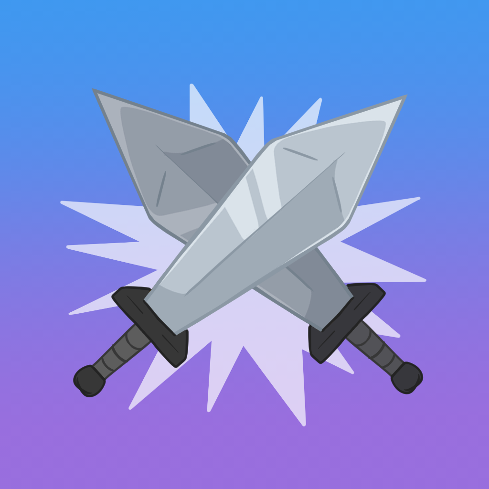

<div align="center">

# Crazy Color Clash

The website for the Crazy Color Clash iOS game.

[](https://github.com/Justintime50/crazy-color-clash-site/actions)
[](LICENSE)



</div>

## Install

```bash
# Copy the env file, edit as needed
cp src/.env-example src/.env

# Run the setup script which will bootstrap all the requirements and spin up the service
just setup
```

## Usage

Visit `crazycolorclash.localhost` locally or `crazycolorclash.com` in production.

## Deploy

```bash
# Deploy the site locally
just run

# Deploy the site in production
just prod
```

## Development

```bash
# Get a comprehensive list of development tools
just --list
```
